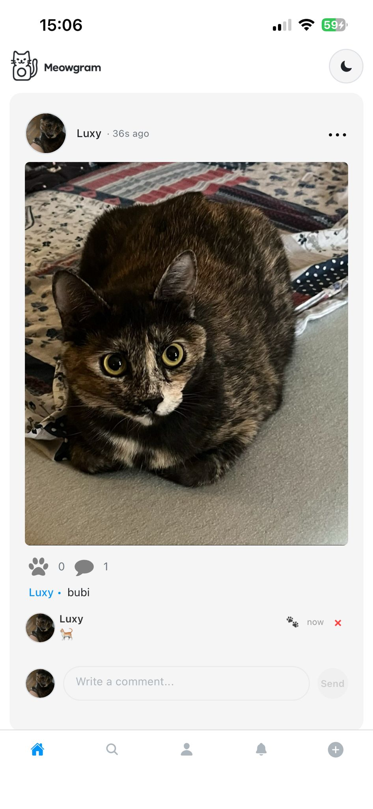
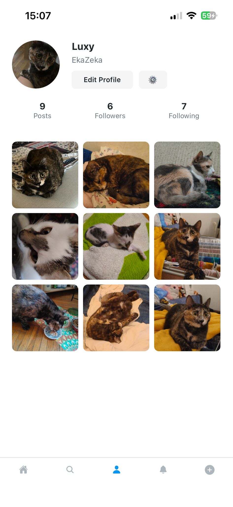
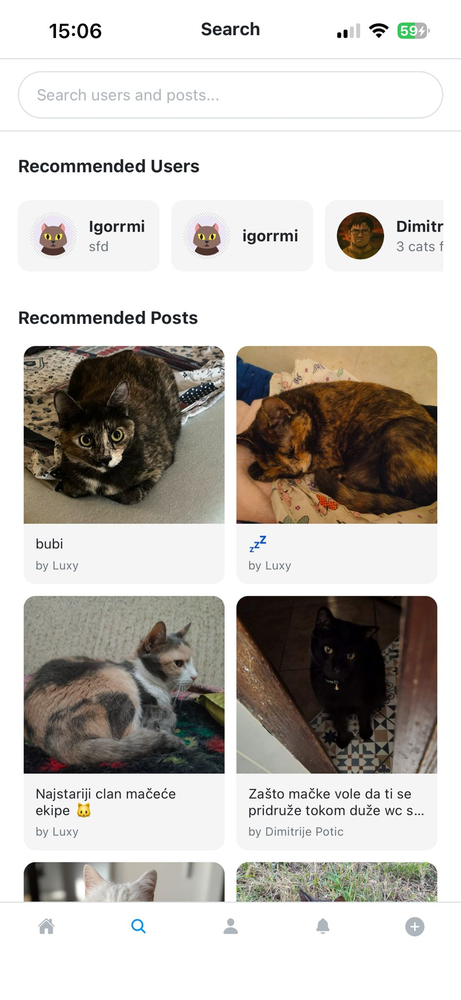
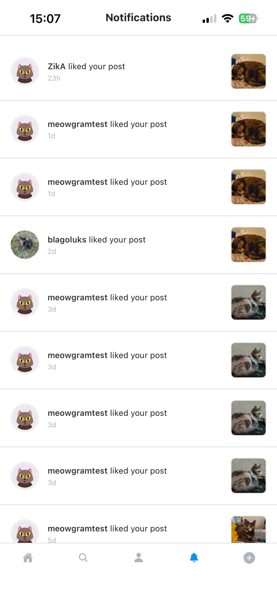
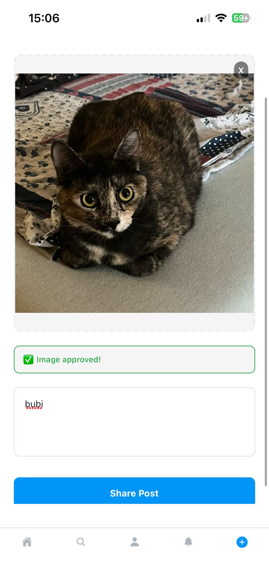

# Meowgram — Mobile App

Meowgram is a mobile-first social app for cat lovers. It lets users share photos, follow other cat profiles, and interact in a lightweight social feed designed for quick browsing and delightful interactions.

This repository contains the mobile app source code (React Native / Expo or plain React Native depending on the project setup). Use this README as an entry point for running, developing, and contributing to the app.

---

## Table of contents

- [Features](#features)
- [Tech stack](#tech-stack)
- [Screenshots](#screenshots)
- [Getting started](#getting-started)
  - [Prerequisites](#prerequisites)
  - [Install](#install)
  - [Run (development)](#run-development)
  - [Environment variables](#environment-variables)
- [Building for release](#building-for-release)
- [Testing](#testing)
- [Contributing](#contributing)
- [Roadmap / Future plans](#roadmap--future-plans)
- [License](#license)
- [Contact](#contact)

---

## Features

- User feed with photos and captions
- Like and comment on posts
- Follow / unfollow other users
- Upload images from device camera or gallery
- Basic profile page and settings
- Offline-friendly image caching (if implemented)
- Simple, responsive UI optimized for phones

(If the repository currently lacks any of the above, treat them as intended or partial features — check source code for real status.)

---

## Tech stack

- React Native/Expo — mobile UI
- TypeScript
- State management: React Context + React hooks
- Networking: fetch / axios
- Image uploads: Cloudinary
- Backend: Firebase
- Authentication: Firebase Auth (depending on implementation)

Adjust the above to match the actual project's implementation details.

---

## Screenshots

### Screenshot 1



### Screenshot 2



### Screenshot 3



### Screenshot 4



### Screenshot 5



## Getting started

### Prerequisites

- Node.js (LTS)
- npm or yarn
- Android Studio (for Android emulator) and/or Xcode (for iOS simulator / builds)
- Java JDK (for Android)
- A backend API (URL and API keys) or a local mock server if the app depends on one

If this project uses Expo:

- expo-cli: `npm install -g expo-cli`

### Install

1. Clone the repository
   git clone https://github.com/blagojevics/meowgram-mobile-app.git
2. Enter the project directory
   cd meowgram-mobile-app
3. Install dependencies
   npm install
   or
   yarn install

### Environment variables

Create a `.env` file at the project root (or follow the app-specific env pattern) and add variables required by the project. Example vars you might need:

```
API_URL=https://api.example.com
GOOGLE_MAPS_API_KEY=your_key
FIREBASE_API_KEY=your_key
STORAGE_BUCKET=...
```

Never commit real secret keys. Use `.env.example` to document required variables.

### Run (development)

If this is an Expo app:

- Start Metro / Expo
  npm start
  or
  yarn start
- Use Expo Go on your device or run in an emulator:
  - iOS: press `i` or run `expo run:ios`
  - Android: press `a` or run `expo run:android`

If this is bare React Native:

- Start Metro
  npm run start
- Run on Android
  npm run android
- Run on iOS
  npm run ios

Refer to package.json scripts for exact commands.

---

## Building for release

Android:

- Generate a release keystore
- Configure `android/app/build.gradle` with keystore settings
- `cd android && ./gradlew assembleRelease`

iOS:

- Open `ios/Meowgram.xcworkspace` in Xcode
- Set signing & capabilities
- Archive and export for App Store submission

If using Expo, follow Expo's build docs:

- `eas build` (recommended)
- Or `expo build:android` / `expo build:ios` for classic builds (depending on Expo version)

---

## Testing

- Unit tests: (Jest) — run `npm test` or `yarn test` if tests exist
- E2E tests: (Detox / Appium) — configure device/emulator and run test commands if implemented

Add tests as features are stabilized.

---

## Contributing

We welcome contributions!

- Fork the repo
- Create a feature branch: `git checkout -b feat/my-feature`
- Make changes and add tests
- Open a pull request describing your changes

Please follow existing code style and add documentation for new features. If you're not sure where to start, check the issues or open one requesting guidance.

---

## Roadmap / Future plans

Planned enhancements (short/medium term):

- Google Sign-In

  - Add OAuth-based authentication so users can sign in with Google accounts.
  - Support linking existing accounts and account recovery flows.

- Chat / Direct Messaging

  - Real-time chat between users (1:1 DMs, group chats).
  - Typing indicators, read receipts, message attachments.

- iOS App Store release

  - Prepare an App Store listing, screenshots, privacy policy, and comply with App Store review guidelines.
  - Implement App Store-specific build and CI pipelines.

- More styling and features

  - UI polish and consistent design system.
  - Additional profile customization, reactions, post editing, and advanced search/filtering.
  - Accessibility improvements and internationalization.

- Other possible items
  - Push notifications (Firebase / APNs)
  - Content moderation tools and reporting
  - Analytics and crash reporting
  - Performance improvements and offline sync

If you'd like to prioritize or expand any of these, open issues or assign tasks and I can help break them down into actionable PRs.

---

## Known issues / Troubleshooting

- If images fail to upload, verify `API_URL`, storage credentials, and CORS settings on the backend.
- If Android build fails with gradle errors, try clearing Gradle cache and running `cd android && ./gradlew clean`.
- For iOS code signing problems, ensure correct provisioning profiles and team settings in Xcode.

Add project-specific troubleshooting steps as they arise.

---

## License

MIT © 2025 blagojevics

---

## Contact

Maintainer: blagojevics  
Repo: https://github.com/blagojevics/meowgram-mobile-app
